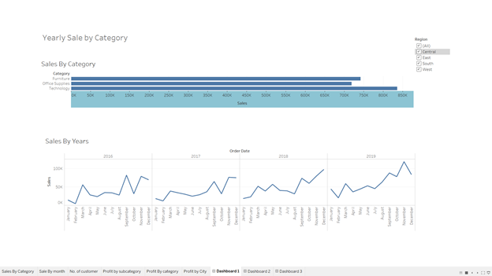
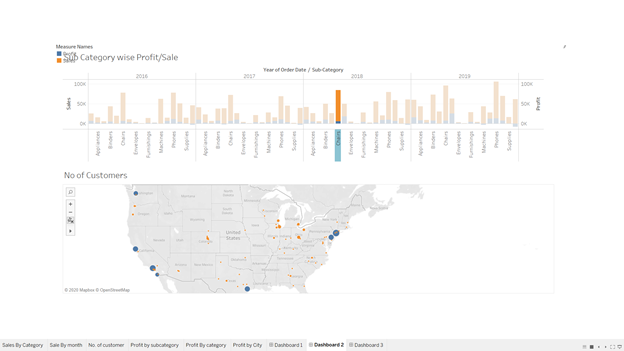
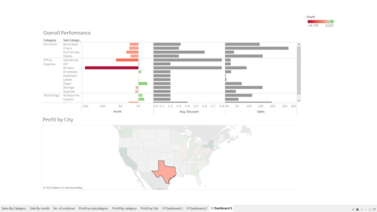

#  Sales Performance Dashboards

## Overview ##

I have created a few Tableau Dashboards using Tableau's Superstore sample dataset. All the tableau dashboards are stored in "tableau" directory.

## Dashboards ##

1. Yearly sale by category:

This dashboard displays yearly sale with its product category. How sales has changed each year for each product for all region.

2. Sub category wise Profit/Sale:

This dashboard displays correlation between profit & loss.

3. Overall performance:

This dashboard displays correlation between Sale, Discount, and profit. 

